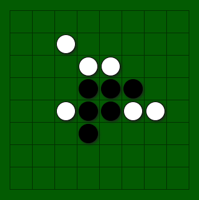

# web-othello
When built and served, will allow people to play Othello over the internet.

## General
### Motivation

Developed as a part of the Code Chrysalis Immersive Bootcamp Curriculum. The initial version was created as a part of a solo 2-day MVP project, May 13-15, 2019.

### Screenshot
The board in v1.0.



## Tech/framework used

<b>Built with</b>
- [Node.js](https://nodejs.org/en/)
- [Express Server](https://expressjs.com/)
- [Vue](https://vuejs.org/)
- [Vuex](https://vuex.vuejs.org/)
- [socket.io](https://socket.io)

## Project setup
```
yarn install
```

### Tests
Currently, no automated tests exist for Eibar.

### Vue Customize configuration
See [Configuration Reference](https://cli.vuejs.org/config/).

## Scripts

Install dependencies:
`yarn install`

Vue hot-reloading:
`yarn serve`

To build latest application:
`yarn build`

To start Express server
`yarn start`

To start hotloading Express server (nodemon)
`yarn devserv`

To build latest application and start express server:
`yarn restart`


## Contribute

Feel free to open issues in the repository.

For pull requests, please create a new branch from the `testing` branch, and submit your pull requests to `testing`.

## Credits

Thanks to [Code Chrysalis](https://github.com/codechrysalis) for inspiring us every day to be better developers!

## License

[Common Development and Distribution License 1.0](https://opensource.org/licenses/CDDL-1.0)
